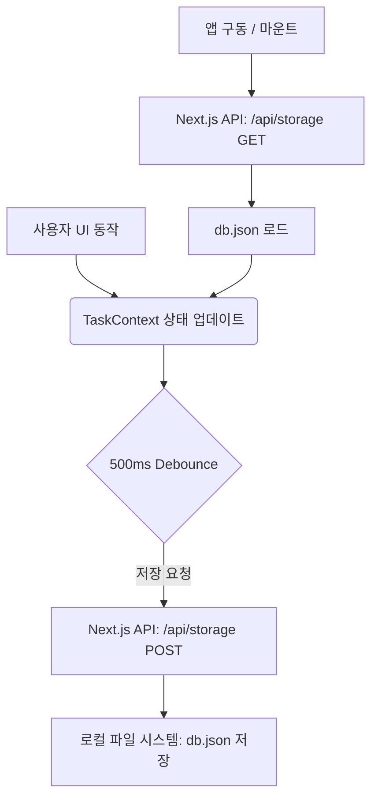
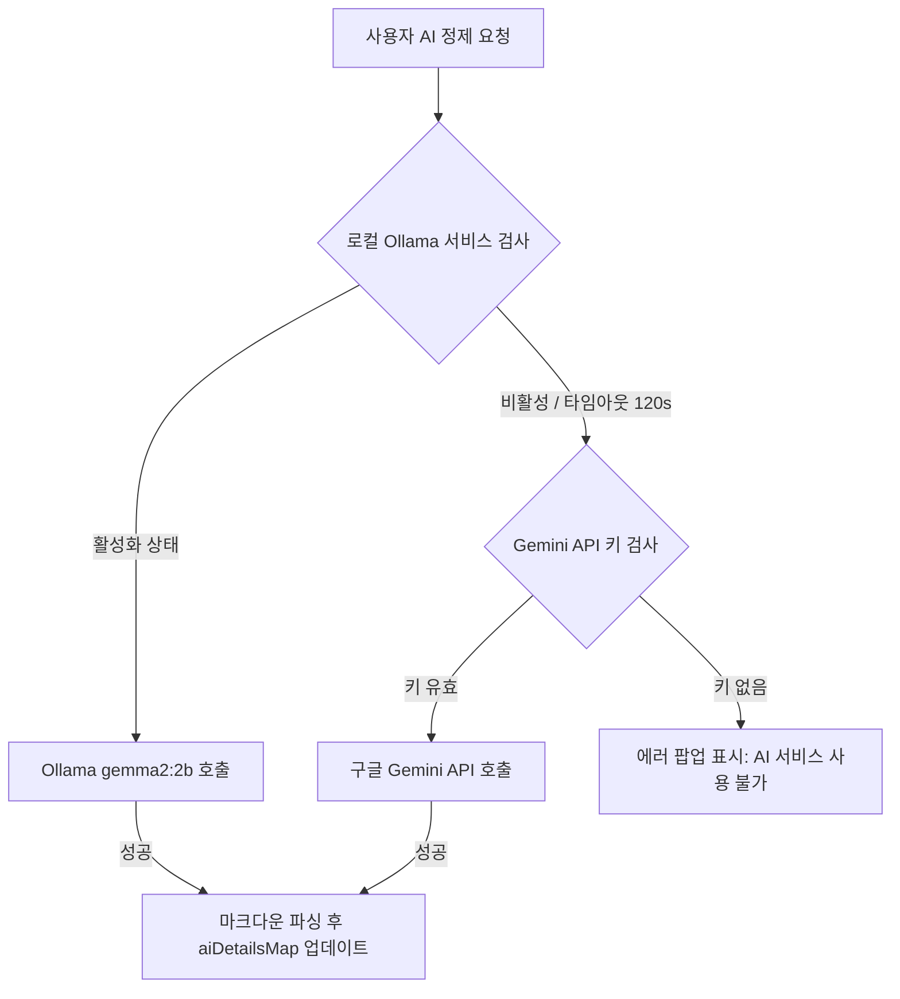

# [PRD] WorkLog(워크로그) 제품 요구사항 명세서

---

## 1. 제품 개요 (Product Overview)

### 1.1 배경 (Background)
현대 지식 근로자 및 개발자들은 일일 업무 기록(Daily Standup, 업무 일지)을 정기적으로 작성해야 하는 번거로움을 겪고 있습니다. 기존의 메모 앱이나 To-Do 서비스는 단순히 목록만 나열할 뿐, 업무의 실무적 맥락을 파악하여 세련된 보고 문장으로 다듬어주거나 기여도를 정밀하게 시각화해 주는 기능이 부족합니다. 
또한 클라우드 기반 서비스들은 민감한 사내 업무 데이터가 외부 서버로 유출될 위험을 안고 있습니다.

**WorkLog**는 이러한 문제를 해결하기 위해 탄생한 **개인 중심의 로컬 오프라인-퍼스트 업무 일지 도우미**입니다. 오프라인 로컬 LLM을 통한 강력한 업무 정제(Refinement) 기능과 완벽한 데이터 로컬 제어를 데스크톱 앱 환경에서 제공합니다.

### 1.2 비전 및 목표 (Vision & Goals)
- **로컬 보안성 극대화**: 업무 데이터를 로컬에 파일 형태로 저장하여 정보 유출 걱정 없는 100% 안전한 업무 기록 환경을 구축합니다.
- **AI 기반 업무 세련화**: 투박하게 입력한 일일 To-Do 리스트를 "팀장급 전문가" 수준의 정돈되고 세련된 실무 문장으로 변환합니다.
- **업무 메트릭 시각화**: 주간/월간 업무 패턴과 프로젝트 비중을 직관적인 차트로 보여주어 자가 회고 및 피드백을 돕습니다.
- **원클릭 보고서 생성**: 번거로운 업무 보고 작성을 마크다운 및 리포트 형식으로 자동 컴파일하여 즉시 실무에 활용 가능하게 합니다.

### 1.3 타겟 사용자 (Target Audience)
- 매일 업무 보고나 주간 일지를 작성하여 제출해야 하는 **개발자 및 지식 근로자**
- 네트워크 연결이 제한된 보안 구역(망분리 환경)에서 근무하는 **보안 민감 직군**
- 일일 업무 효율을 시각적으로 모니터링하고 자가 생산성을 극대화하려는 **1인 기업가 및 프리랜서**

---

## 2. 핵심 기능 요구사항 (Key Functional Requirements)

### 2.1 일일 업무 관리 (Task Management)
- **기능 설명**: 사용자는 매일 수행할 업무를 추가, 수정, 삭제, 완료 처리할 수 있습니다.
- **상세 사양**:
  - **업무 생성**: 태스크 제목을 입력하고 적절한 '프로젝트 카테고리'를 매핑하여 등록합니다.
  - **상태 관리**: `Todo`와 `Completed` 상태를 지원하며, 체크박스 클릭 한 번으로 즉시 토글 및 완료 타임스탬프를 기록합니다.
  - **프로젝트 관리**: 사용자는 커스텀 프로젝트(업무 카테고리)를 추가할 수 있고, 각 프로젝트마다 고유한 테마 색상(Color Hex)을 매핑하여 구분 지을 수 있습니다.
  - **데이터 로딩 최적화**: 중복 조작 방지를 위해, 비동기 데이터 로딩 완료 전까지 태스크 생성을 제어하는 가드 장치가 적용됩니다.

### 2.2 AI 업무 정제 (AI Refinement)
- **기능 설명**: 거칠게 작성된 일일 To-Do 리스트를 AI가 분석하여 세련된 세부 업무 블릿 포인트(2~3개)로 자동 분해 및 윤문합니다.
- **상세 사양**:
  - **하이브리드 AI 파이프라인**: 
    1. **로컬 우선 처리**: 사용자의 로컬 환경에 설치된 Ollama(`gemma2:2b` 모델 권장)를 기본 호출하여 100% 오프라인 정제를 지원합니다.
    2. **클라우드 폴백(Fallback)**: 로컬 Ollama를 사용할 수 없거나 타임아웃(120초)이 발생할 경우, 설정된 구글 `Gemini API`를 통해 정제 작업을 중단 없이 우회 처리합니다.
  - **프롬프트 템플릿**: 실무 팀장급의 전문적 톤앤매너로, 간결하고 명확한 업무 수행 명세(~ 보완 완료, ~ 정리 등)로 변환합니다.
  - **매핑 저장**: 정제된 텍스트는 `aiDetailsMap`에 각 일자별-태스크ID별 키 구조로 영구 보관되며 UI에 블릿 포인트로 표시됩니다.

### 2.3 월간 캘린더 뷰 (Calendar View)
- **기능 설명**: 달력 인터페이스를 통해 과거 기록을 쉽게 찾아보고, 특정 날짜의 업무를 빠르게 조회 및 즉석 수정합니다.
- **상세 사양**:
  - **월간 오버뷰**: 일자별 완료된 업무 개수 및 진행 중인 업무 개수가 미니멀한 뱃지/도트를 표기되어 한눈에 업무 분포를 확인합니다.
  - **일자 이동 & 생성**: 임의의 날짜를 클릭하면 우측 또는 팝업에 해당 일자의 To-Do 리스트가 필터링되어 출력되며, 그 상태에서 해당 날짜로 바로 업무를 추가할 수 있습니다.

### 2.4 업무 통계 및 분석 (Stats & Analytics)
- **기능 설명**: Recharts 라이브러리를 이용하여 누적 업무 데이터에 기반한 생산성 대시보드를 시각적으로 구현합니다.
- **상세 사양**:
  - **프로젝트 점유율 차트**: 전체 업무 중 각 프로젝트(예: 개발, 디자인, 개인 업무)가 차지하는 시간적 비중을 파악하기 쉽게 원형(Pie) 차트로 시각화합니다.
  - **주간/월간 완수 트렌드**: 지난 7일간 또는 월간 단위의 일별 완료율 및 생성률을 막대/선형(Bar/Line) 차트로 대조하여 업무 완수 트렌드를 보여줍니다.
  - **생산성 인사이트**: 가장 활발히 업무가 등록된 요일, 평균 완수 시간 등의 유용한 요약 데이터를 제공합니다.

### 2.5 업무 보고서 생성기 (Report Generator)
- **기능 설명**: 선택된 날짜나 주간 동안의 업무 리스트와 AI가 정제한 세부 내용을 조합하여 마크다운 포맷의 깔끔한 최종 보고서를 컴파일해 줍니다.
- **상세 사양**:
  - **원클릭 클립보드 복사**: 마크다운 렌더링된 텍스트를 클릭 한 번으로 복사하여 노션, 지라, 메일 본문 등에 즉시 붙여넣을 수 있습니다.
  - **고급 마크다운 파싱**: `react-markdown` 및 `remark-gfm`을 활용하여 스타일이 적용된 완성도 높은 미리보기를 화면에 제공합니다.

---

## 3. 아키텍처 및 데이터 흐름 (Architecture & Data Flow)

### 3.1 기술 스택 요약 (Tech Stack)
- **프레임워크**: Next.js 16 (App Router 기반)
- **런타임**: Electron 41 (데스크톱 독립 앱 빌드) & 웹 (Vercel 배포 호환)
- **상태 관리**: React Context API (`TaskContext`)를 통한 실시간 동기화 및 전역 상태 제어
- **스타일링**: CSS Modules (`*.module.css`) + 전역 테마 토큰 (`globals.css`)
- **시각화**: Recharts
- **마크다운**: React Markdown, Remark GFM

### 3.2 로컬 파일 스토리지 아키텍처
데이터 누수 및 유출 위험을 원천 차단하기 위해 원격 데이터베이스 대신, 로컬 파일 시스템을 메인 스토리지로 사용합니다.
- **데이터 저장 파일**: `/Users/apple/Desktop/A/worklog/data/db.json`
- **저장소 동작 흐름**:
  1. **초기화**: 앱 실행 시 `db.json`이 존재하지 않을 경우 디렉토리 자동 생성 및 기본 카테고리와 함께 빈 파일 데이터 초기화.
  2. **조회 (GET)**: `/api/storage` 엔드포인트를 호출하여 `fs.readFileSync`로 JSON 문자열을 파싱해 리액트 상태에 반영.
  3. **저장 (POST)**: 사용자가 업무 추가, 완료 토글, AI 정제 등 상태를 변경하면 Debounce(500ms) 메커니즘을 거쳐 누적된 변화를 `fs.writeFileSync`를 통해 로컬 파일에 즉시 영구 저장.

### 3.3 AI 하이브리드 파이프라인 흐름

---

## 4. UI/UX 및 디자인 가이드라인

### 4.1 핵심 디자인 컨셉
- **다크 모드 지향 글래스모피즘**: 눈의 피로를 최소화하는 정돈된 다크 그레이와 미드나잇 블루 컬러 스키마를 기조로 삼고, 은은한 반투명 테두리와 광택(Glow) 효과를 가미합니다.
- **비비드 포인트 컬러**: 기본 인터페이스는 미니멀하게 유지하되, 업무 카테고리(프로젝트)별 고유 컬러(블루, 핑크, 그린 등)를 직관적인 강조색으로 사용해 시각적 가독성을 높입니다.
- **마이크로 애니메이션**: `framer-motion`을 적극 활용하여 사이드바가 부드럽게 접히고 펴지며, 태스크 카드를 드래그하거나 상태를 토글할 때 직관적인 리액션 모션을 제공합니다.

### 4.2 화면 구성안
- **사이드바 (Sidebar)**: 
  - 접기/펴기(Collapse) 기능 탑재로 작업 집중도를 제어합니다.
  - 대시보드, 캘린더, 통계 등 주요 서브 메뉴로의 원클릭 라우팅을 보장합니다.
- **업무 대시보드 (Dashboard)**:
  - **상단**: 사용자 이름 환영 메시지 및 현재 선택된 날짜 선택 도구, AI 일괄 정제 버튼.
  - **중간**: To-Do 등록용 고기능성 인풋 창(프로젝트 태그 선택기 및 즉시 등록 지원).
  - **하단**: 미완료 업무와 완료된 업무가 분리 렌더링되는 스크롤 영역.
- **달력 화면 (Calendar)**:
  - 7열 격자 구조의 반응형 캘린더. 날짜 칸마다 일일 업무를 압축 표현한 인디케이터 도트 배치.
- **통계 대시보드 (Stats)**:
  - 카드 레이아웃 내부에 반응형 차트를 배치하여 창 크기가 조절되어도 깨짐 없는 레이아웃 유지.

---

## 5. 비기능 및 성능 요구사항 (Non-Functional)

### 5.1 오프라인 퍼스트 (Offline-First)
- 사용자가 인터넷에 연결되어 있지 않은 비행기나 격리망에서도 데이터 생성 및 조작이 100% 정상 작동해야 합니다.
- 로컬 Ollama 모델 탑재로 AI 요약마저 오프라인 환경에서 완결성을 유지할 수 있어야 합니다.

### 5.2 데이터 무결성 및 성능 (Performance)
- 모든 파일 I/O는 버퍼링 및 비동기 처리되어 리액트의 메인 UI 스레드가 멈추거나 버벅거리는 일(UI Blocking)이 없어야 합니다.
- 빈번한 수정 조작 시 하드웨어 부하를 막기 위해 **Debounced Save** 기능이 필수적으로 가동되어야 합니다.

### 5.3 크로스 플랫폼 및 배포 사양
- macOS 사용자용 DMG 설치 파일 및 일반 웹 브라우저 접속용 빌드를 동시에 완벽하게 지원합니다.
- Electron 환경에서는 네이티브 하드웨어 API와 직접 교류 가능한 구조를 고려하여 `electron-builder` 설정값을 튜닝합니다.

---

## 6. 향후 확장 로드맵 (Future Roadmap)

- **Supabase 원격 클라우드 실시간 동기화**: 
  - 로컬 프라이버시가 핵심이지만, 디바이스 간 동기화를 원격으로 희망하는 사용자를 위해 `lib/supabase.ts` 연동 옵션을 정식 제공(사용자 선택형 하이브리드 싱크 지원).
- **팀 공유 및 주간 업무 일지 자동 메일 발송**:
  - 작성된 리포트를 바탕으로 지정된 팀장에게 매주 금요일 퇴근 전 자동으로 요약 이메일이나 슬랙 메시지를 전달하는 통합 자동화 연동 구축.
